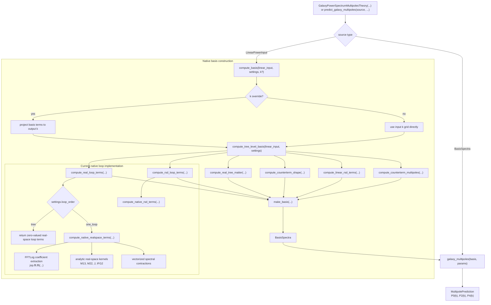
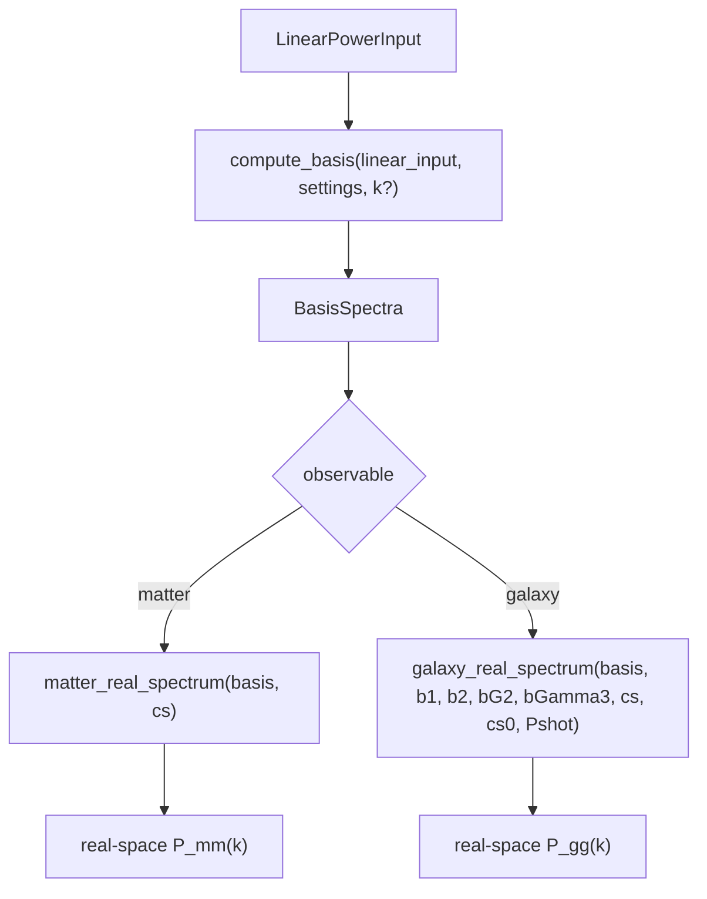

# Prediction Flow

This page documents the current execution flow for `jaxpt` power-spectrum prediction calls.

The canonical entrypoint is now the theory layer in `jaxpt.theories`, typically
`GalaxyPowerSpectrumMultipolesTheory(...)` or
`ClassPTGalaxyPowerSpectrumMultipolesTheory(...)`. The
`predict_galaxy_multipoles(...)` helper remains as a power-spectrum convenience
function, but it is no longer the primary interface.

Tree-level and one-loop predictions share the same basis-construction pipeline, with `settings.loop_order` switching the loop stages between zeros and the analytic FFTLog-native one-loop terms.

## Native Real-Space Flow

The native real-space prediction path reuses the same basis-construction stage and then assembles
the observable in `jaxpt/bias.py`.

The assembly layer is shared between native and synthetic test bases. `CLASS-PT` remains the
validation oracle, but it is no longer a basis-construction branch in the public API.
